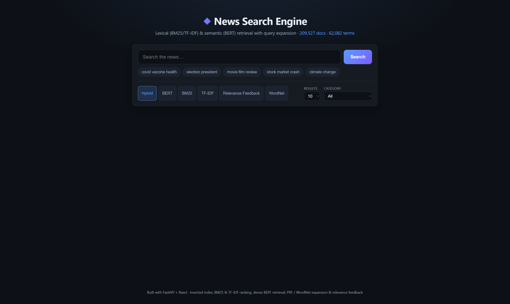
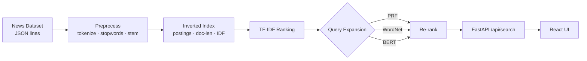

# News Search Engine

A from-scratch **information retrieval system** over 200,000+ news articles —
inverted index, **BM25** and TF-IDF ranking, and three query-expansion
strategies (pseudo-relevance feedback, WordNet synonyms, and BERT embeddings),
served through a **FastAPI** backend and a **React** frontend.

> Built on the [HuffPost News Category Dataset](https://www.kaggle.com/datasets/rmisra/news-category-dataset)
> (~210k articles, 42 categories).



<!-- Replace docs/screenshot.png with a screenshot of the running app. -->

---

## Highlights

- **Indexes 209,527 articles in ~6 seconds** and answers queries with a
  **median latency of ~3 ms** — the index precomputes document lengths and IDF
  once, so no document is ever re-tokenised at query time.
- **BM25 ranking lifts Precision@10 from 0.37 (plain TF-IDF) to 0.55** by
  fixing TF-IDF's short-document bias with term-frequency saturation and proper
  length normalisation.
- **Six retrieval modes** exposed through one API: BM25 and TF-IDF ranking plus
  three query-expansion techniques (and a hybrid).
- **Clean, layered architecture** — a reusable Python package (`news_search`),
  a thin REST API, and a decoupled React UI.
- **Runs out of the box** on a committed sample; scales to the full dataset with
  one command.
- **Tested** with `pytest`, typed dataclasses, and graceful offline fallbacks.

## Architecture



## The retrieval pipeline

1. **Preprocessing** (`preprocess.py`) — lowercasing, punctuation stripping,
   tokenisation, stopword removal, and Porter stemming. The *same* preprocessor
   normalises both documents and queries. It degrades gracefully when NLTK data
   is unavailable (regex tokeniser + bundled stopword list).
2. **Inverted index** (`index.py`) — `term -> [(doc_id, term_freq), ...]`, plus
   precomputed `doc_len`, `idf`, and a forward index used by feedback. Persisted
   with `pickle`.
3. **Ranking** (`ranking.py`) — term-at-a-time scoring over the postings lists,
   with two scorers: classic **TF-IDF** and **BM25** (the default). BM25 adds
   term-frequency saturation (`k1`) and length normalisation (`b`), so a short
   headline no longer outranks a relevant full article. OR-style candidate
   selection means a missing term no longer drops the query to zero results (the
   original implementation was AND-only).
4. **Query expansion** (`expansion.py`):
   - **Pseudo-Relevance Feedback** — assume the top results are relevant and pull
     their most discriminative TF-IDF terms back into the query.
   - **WordNet** — lexical synonym expansion via the WordNet thesaurus.
   - **BERT** — semantic expansion using `all-MiniLM-L6-v2` sentence embeddings
     over the index vocabulary (optional, lazy-loaded).
5. **Evaluation** (`evaluate.py`) — Precision@K, Recall, F1 and latency against
   category-based pseudo-relevance judgments.

## Quickstart

One command does everything — creates the virtualenv, installs dependencies,
builds the index, builds the UI, and launches the app at
`http://localhost:8000`:

```bash
run.bat            # Windows  — BEST MODE (default): sample dataset + BERT
./run.sh           # macOS / Linux

run.bat lite       # sample dataset, no BERT (fastest)
run.bat full       # full ~210k-article dataset + BERT (download it first; slow build)
run.bat full lite  # full dataset, no BERT
```

> Requires Python 3.9+ and Node.js. The browser opens automatically once the
> server is ready. **Best mode (BERT) is always the default** — pass `lite` (or
> `nobert`) to opt out. BERT is a large one-time PyTorch download; on the full
> dataset, building embeddings for the whole ~60k-term vocabulary is slow, so
> use `full lite` if you only need the full corpus without semantic expansion.
> Switching modes automatically rebuilds the index, and the terminal prints what
> loaded, e.g. `Ready: 209,527 documents | 62,090 terms | BERT ENABLED`.

<details>
<summary>Manual steps (if you prefer)</summary>

```bash
# 1. Install
python -m venv .venv && source .venv/bin/activate   # Windows: .venv\Scripts\activate
pip install -r requirements.txt

# 2. Build the index from the committed sample (~700 docs)
python scripts/build_index.py

# 3a. Run the API + built UI on http://localhost:8000
uvicorn api.main:app --app-dir .

# 3b. ...or run the UI in dev mode with hot reload (separate terminal)
cd frontend && npm install && npm run dev   # http://localhost:5173
```

The interactive API docs live at `http://localhost:8000/docs`.
</details>

### Using the full dataset

```bash
python scripts/download_data.py                                   # public mirror, no login
python scripts/build_index.py --data data/News_Category_Dataset_v3.json
# optional: add semantic expansion
pip install -r requirements-bert.txt
python scripts/build_index.py --data data/News_Category_Dataset_v3.json --bert
```

### Offline evaluation

Compare methods with Precision@K / Recall / F1 / latency (pseudo-qrels from the
dataset's category labels):

```bash
python scripts/evaluate.py                 # uses artifacts/index.pkl, or the sample
```

### Single-service deployment

Build the frontend and let FastAPI serve it as static files:

```bash
cd frontend && npm run build && cd ..
uvicorn api.main:app --app-dir .        # serves UI at / and API at /api/*
```

## API

| Endpoint | Description |
|---|---|
| `GET /api/health` | Index stats and available methods |
| `GET /api/categories` | Category list (for the UI filter) |
| `GET /api/search?q=...&method=...&top_k=...&category=...` | Run a search |

`method` ∈ `bm25` · `tfidf` · `prf` · `wordnet` · `bert` · `prf+bert`.

## Results

Measured on the full corpus (209,527 documents, 62,090 unique terms; index built
in ~6 s). Relevance judgments are category-based **pseudo-qrels**, so
**Precision@10 is the meaningful metric** — recall denominators span entire
categories (thousands of docs) and are reported for completeness only.

| Method | Precision@10 | Median latency |
|---|---|---|
| TF-IDF | 0.37 | ~3 ms |
| **BM25** | **0.55** | ~4 ms |
| BM25 + Pseudo-Relevance Feedback | 0.57 | ~9 ms |

> **Two optimisations drove the biggest gains.** (1) The original notebook
> re-tokenised and re-stemmed every candidate document at query time; precomputing
> those statistics at index build took query latency from seconds to single-digit
> milliseconds. (2) Switching from normalised-TF TF-IDF to BM25 fixed a severe
> short-document bias (one-word headlines outranking full articles) and raised
> Precision@10 by ~50%.

## Project structure

```
news-search-engine/
├── src/news_search/      # core library
│   ├── preprocess.py     # tokenize · stopwords · stemming
│   ├── corpus.py         # dataset loading
│   ├── index.py          # inverted index + precomputed stats
│   ├── ranking.py        # TF-IDF scoring
│   ├── expansion.py      # PRF · WordNet · BERT
│   ├── engine.py         # SearchEngine (public API)
│   └── evaluate.py       # P@K · Recall · F1
├── api/main.py           # FastAPI app
├── frontend/             # React + Vite UI
├── scripts/              # download_data.py · build_index.py · evaluate.py
├── notebooks/demo.ipynb  # end-to-end walkthrough
├── tests/                # pytest suite
└── data/                 # sample_news.jsonl (committed)
```

## Tech stack

Python · NLTK · FastAPI · React · Vite · sentence-transformers · pytest

## Roadmap

- Approximate nearest-neighbour (FAISS) for full dense retrieval
- Highlighted query-term snippets in results
- Tunable BM25 parameters (`k1`, `b`) exposed in the UI

## License

MIT — see [LICENSE](LICENSE).
