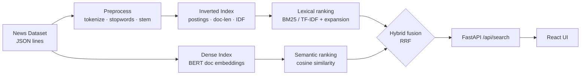

# News Search Engine

A from-scratch **information retrieval system** over 200,000+ news articles. The
full IR stack is implemented by hand — inverted index, **TF-IDF** and **BM25**
ranking, query expansion (relevance feedback, WordNet), and **true dense
semantic retrieval with BERT** — plus a **Hybrid** method that fuses lexical and
semantic search. Served through a **FastAPI** backend and a **React** frontend.

> Built on the [HuffPost News Category Dataset](https://www.kaggle.com/datasets/rmisra/news-category-dataset)
> (~210k articles, 42 categories).


<!-- Add a screenshot at docs/screenshot.png (and optionally a GIF of a search). -->

---

## Highlights

- **Six retrieval methods behind one API** — BM25, TF-IDF, Relevance Feedback,
  WordNet, dense **BERT**, and **Hybrid** (the default).
- **True dense semantic retrieval** — every document is embedded with
  `all-MiniLM-L6-v2`; queries rank by cosine similarity, so results match by
  *meaning* even with zero keyword overlap.
- **Hybrid search (default)** — fuses BM25 and dense rankings with Reciprocal
  Rank Fusion, the modern production approach, robust across keyword *and*
  natural-language queries.
- **Interactive relevance feedback** — mark results as relevant and refine the
  query (Rocchio): real relevance feedback, not just the pseudo kind.
- **Fast lexical core** — 209,527 articles indexed in seconds; lexical queries
  answer in **single-digit milliseconds** because document lengths and IDF are
  precomputed once (no re-tokenisation at query time).
- **Reuse the trained model, don't retrain** — the full-dataset BERT index is
  hosted; the run scripts auto-download it instead of spending ~30 min embedding.
- **Tested** — 39 `pytest` tests, typed dataclasses, graceful offline fallbacks.

## Architecture



## Retrieval methods

| Method | What it does |
|---|---|
| **Hybrid** *(default)* | Fuses BM25 + dense BERT rankings via Reciprocal Rank Fusion |
| **BERT** | Dense semantic retrieval over sentence-transformer document embeddings |
| **BM25** | Okapi BM25 lexical ranking (TF saturation + length normalisation) |
| **TF-IDF** | Classic normalised-TF × IDF ranking, for comparison |
| **Relevance Feedback** | BM25 + Rocchio expansion; *pseudo* by default, or **true** feedback from documents the user marks relevant |
| **WordNet** | BM25 + lexical synonym expansion from the WordNet thesaurus |

The pipeline (`src/news_search/`): **preprocess** (shared tokeniser for docs and
queries, with regex/stopword fallbacks when NLTK data is missing) → **inverted
index** (postings, precomputed `doc_len`/`idf`, forward index for feedback) →
**ranking** (term-at-a-time BM25/TF-IDF, OR-style candidates, optional category
restriction *before* truncation) → **expansion** (relevance feedback, WordNet) /
**dense** (BERT embeddings, cosine search) → **engine** (ties it together).

## Quickstart

One command does everything — creates the virtualenv, installs dependencies,
builds the index, builds the UI, and launches the app at `http://localhost:8000`:

```bash
run.bat            # Windows  — default: sample dataset + BERT (Hybrid default)
./run.sh           # macOS / Linux

run.bat lite       # sample dataset, no BERT (fastest)
run.bat full       # full ~210k-article dataset + BERT
run.bat full lite  # full dataset, no BERT
```

> Requires Python 3.9+ and Node.js. The browser opens automatically once the
> server is ready. **BERT is on by default** — pass `lite` (or `nobert`) to opt
> out. In `full` mode the prebuilt BERT model is **downloaded automatically**
> (see [Reusing the trained model](#reusing-the-trained-model)); if the download
> fails it falls back to building locally. The terminal prints what loaded, e.g.
> `Ready: 209,527 documents | 62,090 terms | BERT ENABLED`.

<details>
<summary>Manual steps (if you prefer)</summary>

```bash
# 1. Install
python -m venv .venv && source .venv/bin/activate   # Windows: .venv\Scripts\activate
pip install -r requirements.txt
pip install -r requirements-bert.txt                # for BERT / Hybrid

# 2. Build the index (+ dense embeddings) from the committed sample (~700 docs)
python scripts/build_index.py --bert

# 3a. Run the API + built UI on http://localhost:8000
uvicorn api.main:app --app-dir .

# 3b. ...or run the UI in dev mode with hot reload (separate terminal)
cd frontend && npm install && npm run dev   # http://localhost:5173
```

The interactive API docs live at `http://localhost:8000/docs`.
</details>

### Using the full dataset

```bash
python scripts/download_data.py                                   # public mirror, no login
python scripts/build_index.py --data data/News_Category_Dataset_v3.json --bert
```

### Reusing the trained model

Embedding the full ~210k-document corpus takes ~30 min on CPU, so the prebuilt
dense model is hosted and reused instead of retrained:

```bash
python scripts/download_model.py     # fetches artifacts/dense.pkl (~308 MB)
```

It downloads from a default Hugging Face URL; override with the `MODEL_URL`
environment variable to point at your own copy (a direct HTTPS link, or a public
Google Drive link — Drive needs `pip install gdown`). The run scripts call this
automatically in `full` mode and skip it when `artifacts/dense.pkl` already
exists, so a model is never retrained unnecessarily. If your GPU has a CUDA build
of PyTorch it is used automatically; otherwise encoding runs on CPU.

### Offline evaluation

```bash
python scripts/evaluate.py     # Precision@K / Recall / F1 / latency per method
```

## API

| Endpoint | Description |
|---|---|
| `GET /api/health` | Index stats and available methods |
| `GET /api/categories` | Category list (for the UI filter) |
| `GET /api/search?q=...&method=...&top_k=...&category=...&relevant_ids=...` | Run a search |

- `method` ∈ `hybrid` · `bert` · `bm25` · `tfidf` · `prf` · `wordnet` (defaults
  to `hybrid`, or `bm25` if BERT isn't built).
- `relevant_ids` (repeatable) — document ids the user marked relevant; turns
  `prf` into true relevance feedback.

## Results

Measured on the full corpus (209,527 documents, ~62k unique terms). Relevance
judgments are category-based **pseudo-qrels**, so **Precision@10 is the
meaningful metric** (recall denominators span entire categories).

| Method | Precision@10 | Latency/query |
|---|---|---|
| Relevance Feedback (PRF) | 0.48 | ~13 ms |
| BM25 | 0.45 | ~6 ms |
| **Hybrid (BM25 + BERT)** | 0.43 | ~24 ms |
| BERT (dense) | 0.42 | ~19 ms |
| TF-IDF | 0.38 | ~4 ms |
| WordNet | 0.23 | ~340 ms |

> **Reading these honestly.** On *keyword* queries judged by *category match*,
> lexical methods (PRF/BM25) edge out dense retrieval — expected, because the
> metric rewards exact term/category overlap, while dense retrieval's strength is
> semantic matching on *natural-language* queries (which the live demo shows but
> category pseudo-qrels can't capture). With only a handful of eval queries these
> differences are within noise; Hybrid is the default because it is the most
> robust across query types. WordNet expansion *lowers* precision here (noisy
> synonyms) — a useful negative result.

## Project structure

```
news-search-engine/
├── src/news_search/      # core library
│   ├── preprocess.py     # tokenize · stopwords · stemming
│   ├── corpus.py         # dataset loading
│   ├── index.py          # inverted index + precomputed stats
│   ├── ranking.py        # BM25 / TF-IDF scoring
│   ├── expansion.py      # relevance feedback · WordNet
│   ├── dense.py          # dense BERT retriever (document embeddings)
│   ├── engine.py         # SearchEngine (public API)
│   └── evaluate.py       # P@K · Recall · F1
├── api/main.py           # FastAPI app (serves API + built UI)
├── frontend/             # React + Vite UI
├── scripts/              # download_data.py · build_index.py · download_model.py · evaluate.py
├── notebooks/demo.ipynb  # end-to-end walkthrough
├── tests/                # pytest suite (39 tests)
└── data/                 # sample_news.jsonl (committed)
```

## Tech stack

Python · NLTK · FastAPI · React · Vite · sentence-transformers · NumPy · pytest

## Roadmap

- Approximate nearest-neighbour (FAISS/HNSW) for faster dense retrieval at scale
- Cross-encoder re-ranking of the top hits (retrieve-and-rerank)
- Human-judged relevance set + nDCG@10 to evaluate semantic quality fairly
- Highlighted query-term snippets; tunable BM25 `k1`/`b` in the UI

## License

MIT — see [LICENSE](LICENSE).
